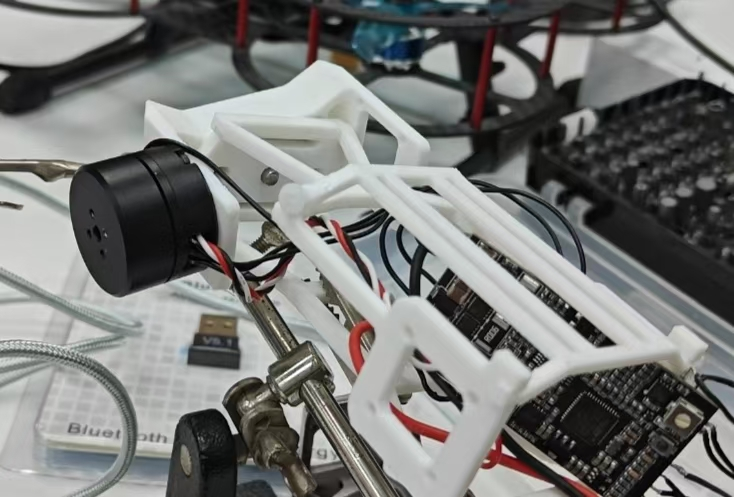
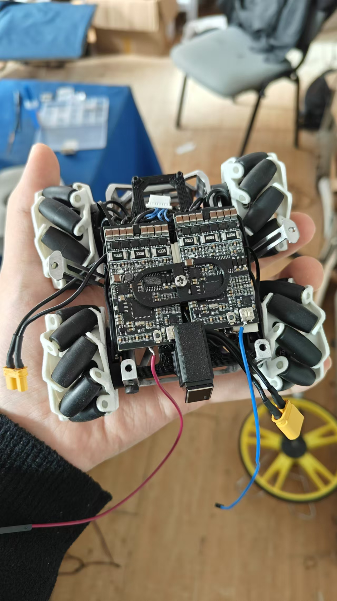
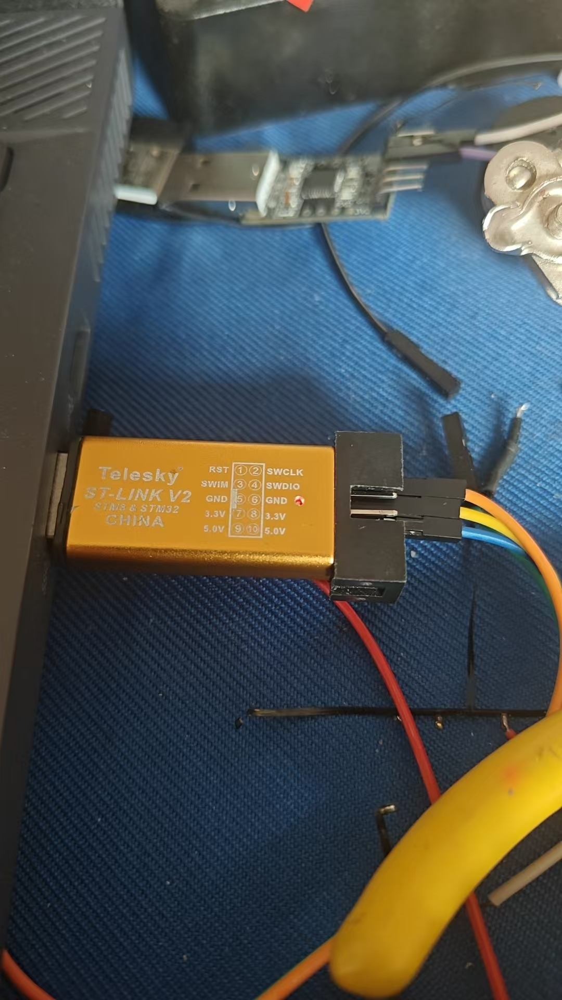
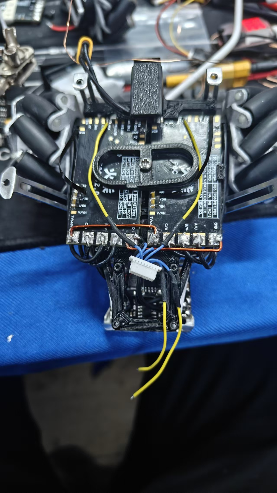

在适配HT2205电机与simplefoc控制板时使用的代码。

向hfoc控制板中最终烧录的是simpefocFor2205Debug，因为debug保留有串口输出，可以减少调参和排障工作量。

采用它们做了轮毂电机，扭矩很小，但得以于载具并不大的重量和较低的滚阻，仍然能达到很快的速度。

stlink的3v3最好不要给芯片供电，防止任何潜在的危险。

不专业且缺乏安全措施的操作，pwm信号也受到较大干扰，但还是坚持到做完了。下一步必须优化可靠性了。

需要降低驱动板芯片运行的时钟频率，目前stm32G431速度很快运行起来温度很高。